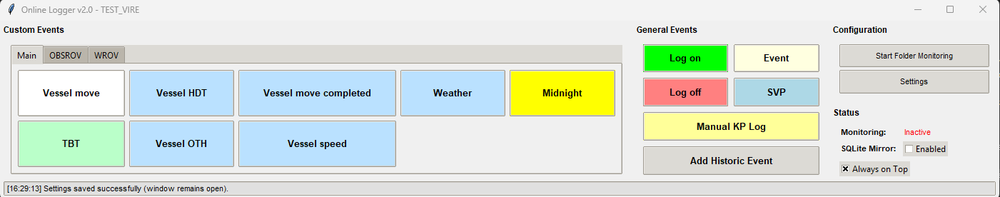
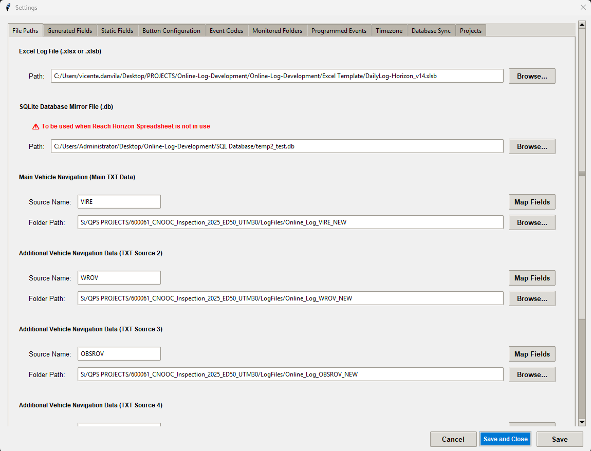

# Online-Log-Development (Field Log Automation Tool)

A Windows-focused Python application that monitors incoming navigation/survey files, extracts events, and writes them into a structured Excel Daily Log workbook. It also manages per-project settings so you can switch quickly between jobs while keeping templates, event codes, and folder paths organized.

> Full documentation is available in the PDF user guide:
> - [Field Log User Guide (PDF)](Guide/Field%20Log%20User%20Guide.pdf)





## Features

- Watches multiple source folders (e.g., Qinsy, Naviscan, SVP) and parses new files automatically
- Writes to a macro-enabled Excel template using xlwings
- Per-project settings with quick Load / Save / Restore
- "Blank project" template to reset settings safely
- Remembers your last active project between sessions
- Ships with default and customizable event codes

## Repository layout (high level)

- `Python Script/Online_Log_SQL_Lite.py` — main application entry point (Tkinter GUI)
- `Python Script/requirements.txt` — Python dependencies
- `Excel Template/` — Excel workbook(s) used as the Daily Log template
- `Monitored Folders For Testing/` — sample folders/files you can use to simulate input
- `settings/` — default/custom settings and event codes
- `Guide/Field Log User Guide.pdf` — detailed user documentation (PDF)

## Requirements

- Windows with Microsoft Excel installed (required by xlwings)
- Python 3.10+ (tested with Python 3.13)
- PowerShell (examples below use it)

Python packages:

```
customtkinter
Pillow
requests
xlwings
watchdog
pandas
openpyxl
```

You can install them from `Python Script/requirements.txt`.

## Quick start (Windows PowerShell)

```powershell
# 1) (Recommended) create and activate a virtual environment
python -m venv .venv
.\.venv\Scripts\Activate.ps1

# 2) Install dependencies
pip install -r "Python Script/requirements.txt"

# 3) Run the application
python "Python Script/Online_Log_SQL_Lite.py"
```

When the UI opens, choose your Excel template, monitored folders, and event codes in the Projects tab, then click Load/Save as needed.

## Projects and Settings (overview)



- Browse or New: Point the app to an existing project JSON or start a new one.
- Load Project: Loads the selected project JSON and applies its settings to the UI and runtime.
- Save / Save As: Saves the current configuration to a project JSON for reuse.
- Restore Defaults: Loads the blank project template, resetting the UI to a clean baseline without touching your saved projects.
- Persistence: The app remembers your last active project between sessions so you can pick up where you left off.

Default files live under `settings/`:

- `settings/default_settings.json`
- `settings/custom_settings.json`
- `settings/event_codes.json`

Your own project files can live anywhere; a common place is a `settings/projects/` folder you create.

## Excel template

The default template is located at:

- `Excel Template/DailyLog-Horizon_v14.xlsb`

You can replace it with your own, as long as required sheets/macros are present. Enable macros in Excel and keep Excel installed/available for xlwings to function.

## Sample data

Use the files under `Monitored Folders For Testing/` to simulate incoming data:

- `Monitored Folders For Testing/Qinsy/`
- `Monitored Folders For Testing/Naviscan/`
- `Monitored Folders For Testing/SVP/`

Drop supported files in those folders and watch the UI update and the Excel log populate.

## Troubleshooting

- If you try to run the .exe but it doesn't work or it opens and closes quickly, probably the Windows Firewall is blocking the execution of the program (Windows doesn't recognize the .exe from a trustable author). You have to autorize this program explicitly in `Control Panel\System and Security\Windows Defender Firewall\Allowed apps`.
- Excel is required. If launch or write fails, confirm Excel is installed and not blocked by your antivirus or policy.
- If xlwings cannot attach to Excel, try closing all instances of Excel and relaunching the app.
- If you see permission errors writing the workbook, ensure the Excel file isn't open in read-only mode.
- If file monitoring seems inactive, double-check the folder paths and that Windows has access rights to those directories.

## Documentation

For detailed workflows, configuration examples, and screenshots, see:

- [Field Log User Guide (PDF)](Guide/Field%20Log%20User%20Guide.pdf)


## Contributing

Issues and improvements are welcome. Please:

- Use feature branches and open PRs against `main`.
- Keep changes focused and include a brief description.


